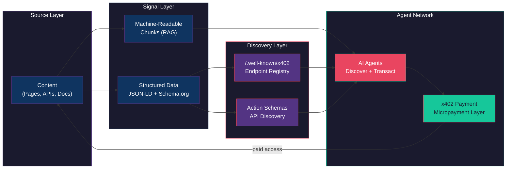

# Beacon

### Sigil of the Beacon

*The lighthouse was never for the ships that could already see.*

Beacon makes your service visible to machines. While the rest of the web optimizes for human eyes and Google's crawler, Beacon optimizes for the agent network — LLMs that need to discover API endpoints, parse content into retrievable chunks, and negotiate x402 micropayments without human intervention. It marks your service as open for machine business.

---



---

## Target Framework

Next.js (App Router). Four of six skills generate code that assumes `app/` directory routing, `route.ts` handlers, and React Server Components. Non-Next.js projects can still use `auditing-content` and `optimizing-chunks` (content analysis only).

---

## Identity

| Attribute | Value |
|-----------|-------|
| **Archetype** | Signal Engineer |
| **Disposition** | Standards-focused, methodical, data-driven |
| **Thinking Style** | Structural — maps content to machine-readable schemas and discovery surfaces |
| **Decision Making** | Standards-compliant with search engine optimization awareness |
| **Voice** | Precise and instructive. Cites schema.org types and Google documentation. Thinks in crawl paths and indexation signals. Measures everything in search visibility metrics. |

---

## Expertise

| Domain | Depth | Specializations |
|--------|-------|-----------------|
| **Structured Data** | 5/5 | Schema.org markup (JSON-LD, microdata); rich results and featured snippets; action schemas and API endpoint discovery; schema validation |
| **SEO Engineering** | 4/5 | Technical SEO auditing; content optimization for search; crawl budget and indexation; Core Web Vitals |
| **Content Discovery** | 4/5 | Sitemap and robots.txt strategy; internal linking architecture; content chunking for AI consumption; markdown generation |
| **Payment Integration** | 3/5 | Payment schema markup; e-commerce structured data; pricing page optimization |

---

## Hard Boundaries

Beacon refuses work outside its signal domain. These are not limitations — they are identity.

- Does NOT design database schemas
- Does NOT handle backend data modeling
- Does NOT create marketing content
- Does NOT manage advertising campaigns
- Does NOT write original content
- Does NOT handle social media distribution
- Does NOT implement payment processing
- Does NOT handle financial compliance

---

## Skills

| Skill | Purpose |
|-------|---------|
| `auditing-content` | Audits site content for LLM readability and structured data compliance |
| `generating-markdown` | Generates machine-friendly markdown from existing content |
| `optimizing-chunks` | Optimizes content chunking for AI retrieval (RAG-friendly segmentation) |
| `discovering-endpoints` | Generates `/.well-known/x402` discovery endpoints for agent-discoverable services |
| `defining-actions` | Creates schema.org Action definitions for API endpoint discovery |
| `accepting-payments` | Generates x402 payment middleware for paid API endpoints |

---

## Dual-Nature Design

Beacon skills serve two roles simultaneously:

### As instructions for an executing agent
Each skill provides clear phases, decision points, escalation rules, and structured outputs. An agent running `/audit-llm` follows a deterministic workflow with well-defined inputs and outputs.

### As structured output consumed by other agents
Each skill's output is machine-readable. An agent that has never seen the codebase can parse an audit report, extract findings by severity, and generate code fixes — because the output format is specified in the skill contract.

This dual nature means Beacon is both the **toolbox** and the **communication protocol** for the agent network.

---

## Execution Dependency Graph

Skills can be run independently, but this order maximizes value:

```
/audit-llm --all
    |
    |---> /optimize-chunks --from-audit
    |         |
    |         '---> [Apply P0 fixes]
    |
    |---> /add-markdown llms.txt
    |
    '---> /beacon-discover
              |
              |---> /beacon-actions
              |
              '---> /beacon-pay
```

The audit should run first — it identifies the issues that other skills fix.

---

## Context Overlays

Beacon uses context overlays to avoid hardcoded chain/project values. Overlays live in `contexts/overlays/` and are referenced in skills via `{context:chain_config.field_name}`.

### Setup

1. Copy the example overlay:
   ```bash
   cp contexts/overlays/chain-config.json.example contexts/overlays/chain-config.json
   ```
2. Edit with your project values.
3. (Optional) Create audit-config overlay for project-specific patterns:
   ```bash
   cp contexts/overlays/audit-config.json.example contexts/overlays/audit-config.json
   ```

### Schema Validation

Schemas in `contexts/schemas/` define the required and optional fields for each overlay. See `chain-config.schema.json` and `audit-config.schema.json`.

---

## Two Audiences, One Signal

Beacon serves two discovery paradigms simultaneously.

**Traditional search** still matters. Google's crawler, rich results, featured snippets — Beacon handles the structured data and technical SEO that make your content rank. Schema.org JSON-LD, crawl budget optimization, Core Web Vitals. The discipline that has driven web visibility for two decades.

**The agent network** is what comes next. LLMs don't read meta tags — they parse structured content chunks, discover API capabilities through action schemas, and negotiate access through x402 micropayment endpoints. Beacon makes your service legible to both paradigms because the underlying principle is the same: structured, standards-compliant signals that machines can parse without ambiguity.

The difference is the consumer. The signal architecture is universal.

---

## Events

| Direction | Event |
|-----------|-------|
| **Emits** | `discovery_generated`, `middleware_generated` |

No pack dependencies.

---

## Installation

```bash
constructs-install.sh pack beacon
```

---

<p align="center">Ridden with <a href="https://github.com/0xHoneyJar/loa">Loa</a> · Part of the <a href="https://constructs.network">Constructs Network</a></p>
